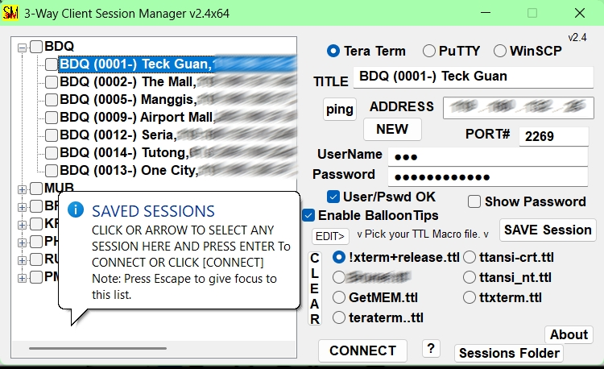
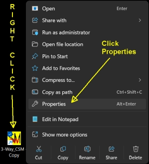

TeraTerm is a Very Fine SSH Client for general professional use. The main weakness is lacking the abiliy to save your sessions as you go. There is a Very lame "menu" companion app that I was never able to get working so I decided to create my own session manager. It is somewhat limited in that it only works for SSH2 sessions, but that is all I needed.

SSHTTSM On Steroids

# 3-Way Client Session Manager

**3-Way Client Session Manager** is a Windows utility for managing and launching SSH/SFTP sessions using **Tera Term**, **PuTTY**, or **WinSCP** from a single interface.  
It supports saved sessions, optional credential storage, Tera Term macros, and automatic session backups.

## Features

- Centralized SSH session list

- Allows Launch **Tera Term**, **PuTTY**, or **WinSCP**

- Optional saved username/password (obfuscated, not plain text)

- Tera Term macro (`.ttl`) support

- Built-in macro file editor

- Session backup rotation

- Ping test for server reachability and internet connectivity

- Single-instance protection

## Requirements

- 64bit Windows OS (Win 11 Certified)

- 53MB Disk Space

- 50MB RAM (minimum)

- Internet connection

- keyboard

- Mouse (optional)

- 1920 x 1080 display (1400x900 actual)

- One or more of the following installed:

  - **Tera Term** (mandatory)

  - **PuTTY**

  - **WinSCP**

NOTE:  The “TT+3-Way\_CSMinstallerX64.exe” Provides all 3 clients as well as the client manager.  
3-Way\_CSM automatically searches common install paths for preinstalled clients.  
Local portable copies of PuTTY and Win SCP placed in the application folder will also be supported.

## Installation

I suggest using the Full package “TT+3-Way\_CSMinstallerX64.exe“ as the simplest method.  Otherwise...

1. Installing **Tera Term** is required for storage of the sessions and optional Macro files.

2. Copy `3-Way\\\\\\\_CSM.exe` to a folder of your choice.

3. (Optional) Place `putty.exe` and/or `WinSCP.exe` into the same folder.

4. Run the application.

> Only one instance may run at a time.

## Creating a Session

1. Enter the:

   - **Session Name**

   - **IP Address**

   - **Port** (default: 22)

2. (Optional) Enter a **Username** and **Password**

3. (Optional) Enable **User/Pswd OK** to allow credentials to be saved

4. Click **SAVE Session**

Sessions appear in the list on the left.

## Connecting to a Session

1. Choose the preferred client:

   - **Tera Term**

     - Select Macro if desired

     - (preferred macro will be auto selected if filename begins with exclamation point)

   - **PuTTY**

   - **WinSCP**

2. Select a session from the list

3. Click **CONNECT** or press **Enter**

### Client Selection:

- **Tera Term**

- **PuTTY**

- **WinSCP**

  - Each Use CLI interface for SSH/SFTP connections

## Password Handling

- Passwords are stored in an **obfuscated, non-readable form**

- To save credentials (New or existing Sessions):

  1. Enter (optional) **Username** and **Password**

  2. Enable **User/Pswd OK (to allow saving)**

  3. Click **SAVE Session**

- Use **Show Password** to temporarily reveal credentials

## Tera Term Macros (`.ttl`)

- Macro files are listed from the teraterm5 (sessions) folder

- Up to **8 macros** are displayed in the main window

- Select a macro before connecting to execute it automatically

- Macro filename beginning with exclamation point will be selected automatically as default.

### Macro Editor

- Select macro file if available

- Click \[\*\*EDIT\] \*\*for the existing macro or to create a new one

- Save or reload macro directly from the built-in editor

- Remrember – Limit of **8 macros** are displayed in the main window

> Restart the application for newly added macros to appear in the main window. You might need to delete one to allow your new macro to become available in pick list.

## Session Logging & File Transfers

> A dedicated \*\*[C:\\XferTemp\*\*](file:///C:/XferTemp) folder is used to manage zmodem file transfers.  Session log files are also written to this same folder.

## Session Storage & Backups

Sessions are stored in a rotating backup system:

| **File Name** | **Description** |
| :-: | :-: |
| `Sessions` | Active sessions file |
| `Sessions1` | Most recent backup |
| `Sessions2` | Older backup |
| **File Name** | **Not Rotated** |
| `SessionsBak` | Very first Backup |

> Each save operation rotates the files 0 1 2 automatically.

## Useful Shortcuts

- **Enter** – Connect to selected session

- **Delete** – Remove selected session

- **Ctrl+C** – Copy `IP:Port` to clipboard (cursor must be inside ADDRESS field)

- **ESC** – Close dialogs or editors

## Ping Test

Click **PING** to verify:

- Server reach-ability

- Active internet connection

Uses the native Windows `ping.exe application`.

## Sessions Folder

Click \[**Sessions Folder\]** button to browse:

- Session files

- Backup files

- Tera Term macro (`.ttl`) files

## Balloon Tips default

Balloon Tips are helpful to Beginners and can become annoying so you have the option of disabling all guiding Popups from your program launch shortcut.

- Right Click your 3-Way\_CSM shortcut.

- Click properties

- Append the target line with a space followed be backslash  and the word “quiet”, as shown below:

## About & Licensing

This application uses CLI to launch **unmodified third-party software**:

- Tera Term

- PuTTY

- WinSCP

All trademarks and licenses belong to their respective authors.  
License, documents, and homepage links are accessible from the **About** window.

## Disclaimer

Provided **AS-IS**, without warranty of any kind.

Enjoy using **3-Way Client Session Manager**

